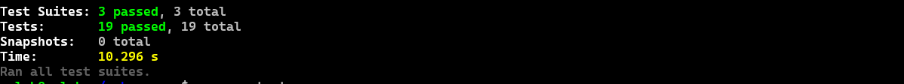

# Pokemon Go Project Documentation

## Overview

Welcome to the official documentation of the Pokemon Go project. This project is a robust CRUD (Create, Read, Update, Delete) application that manages a Pokemon database, integrated with user authentication. Developed using NestJS, this documentation provides an in-depth understanding of the project structure, technologies used, and how to run the application.

## Technologies Used

This section provides an overview of the technologies used in the project:

- **Node.js**: A runtime environment for executing JavaScript on the server.
- **NestJS**: A powerful and extensible framework for building server-side applications.
- **MongoDB**: A NoSQL database used for storing Pokemon and user data.
- **Prisma**: An ORM (Object-Relational Mapping) tool for efficient database access.
- **@nestjs/common**: A core module of NestJS for building controllers, modules, and providers.
- **@nestjs/jwt**: A module for handling JSON Web Tokens (JWT) in NestJS.
- **@nestjs/platform-express**: Express integration for NestJS.
- **@nestjs/swagger**: A module for automatically generating API documentation using Swagger.
- **bcrypt**: A library for hashing and verifying passwords securely.
- **class-transformer**: A library for transforming class objects.
- **class-validator**: A library for data validation.
- **dotenv**: A module for loading environment variables from a .env file.
- **xlsx**: A library for parsing Excel files.

## Database Information

The project uses MongoDB as the database for storing Pokemon and user data. MongoDB is a NoSQL database that provides flexibility for managing unstructured data.

## Project Structure

The project is organized into the following key components:

### Controllers

#### AuthController
- Responsible for authentication and user-related operations.
- Endpoints:
  - `GET /auth`: Retrieves user data.
  - `POST /auth/signup`: Registers a new user.
  - `PUT /auth/:id`: Updates user information.
  - `PATCH /auth/:id/password`: Updates user password.
  - `PATCH /auth/:id/`: Updates user role.
  - `DELETE /auth/:id`: Deletes a user (Admin role required).

#### UserController
- Manages user-related operations and is protected with authentication guards.
- Endpoints:
  - `GET /user`: Retrieves all users.
  - `GET /user/:id`: Retrieves a user by ID.
  - `POST /user/signup`: Registers a new user.
  - `PUT /user/:id`: Updates user information.
  - `PATCH /user/:id/password`: Updates user password.
  - `PATCH /user/:id/`: Updates user role.
  - `DELETE /user/:id`: Deletes a user (Admin role required).

#### PokemonController
- Handles Pokemon-related operations and is also protected with authentication guards.
- Endpoints:
  - `GET /pokemon/insert`: Imports Pokemon data from an Excel file.
  - `GET /pokemon`: Retrieves Pokemon data with optional filtering.
  - `GET /pokemon/:id`: Retrieves a Pokemon by ID.
  - `POST /pokemon`: Creates a new Pokemon.
  - `PUT /pokemon/:id`: Updates Pokemon information.
  - `DELETE /pokemon/:id`: Deletes a Pokemon (Admin role required).

## Running the Project

To run the project, follow these steps:

1. Make sure you have Docker and Docker Compose installed on your system.

2. Open a terminal and navigate to the project directory where your `docker-compose.yml` is located.

3. Run the following command to start the project using Docker Compose:

   ```bash
   docker-compose up
1. After the containers are up and running, you can access Swagger documentation at http://localhost:8080/pokemon-api-docs.

To use the APIs, you need to log in with the following details:
Email: 'admin@pokemon.go'
Name: 'admin'
In Swagger, click on the "Authorize" button and fill in the "Bearer" field with the access token obtained after logging in.

## Running Tests

To run tests for the project, follow these steps:

1. Make sure you have Node.js and npm installed on your system.

2. Navigate to the project directory using the terminal.

3. Run the following command to install the project's dependencies:

   ```bash
   npm install
   npm run test

## Test Results

Below is an example of test results:


